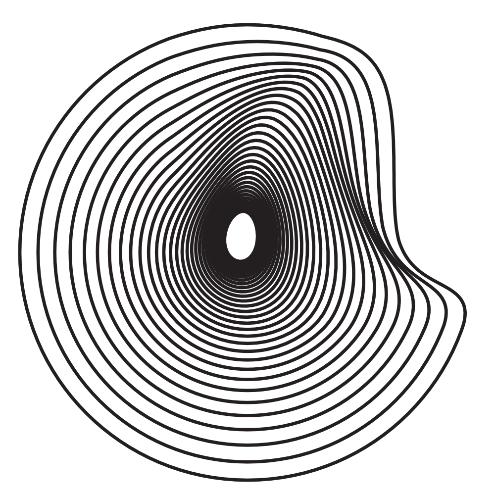

# Embracing Sphere

Immersive audio technologies, such as ambisonics and HRTF (Head-Related Transfer Function),
aim to replicate spatial soundscapes, creating immersive auditory experiences. Despite their
potential applications in gaming, virtual reality, cinema, and assistive tools for the visually
impaired, the adoption of these technologies has faced barriers. These include technical
challenges, high implementation costs, limited public awareness, and the need for compatible
hardware and software. This research will examine the current state of 3D audio, factors limiting
its broader adoption, and opportunities to accelerate innovation, particularly in enhancing
storytelling and accessibility.

The thesis aims to address these gaps by integrating acoustic technologies and sonic interfaces
within artistic contexts. Procedural methods will be employed to generate room impulse
responses based on interactive acoustic parameters. Through this exploration, the thesis will
evaluate the feasibility and artistic potential of using sonic interfaces as tools for creative
expression.

To explore these social behaviours, the thesis will use a questionnaire after presenting sound art
created with the technologies mentioned before. This will help reveal how these technologies are
perceived, any barriers or biases to their adoption, and the overall acceptance of these immersive
audio technologies.

